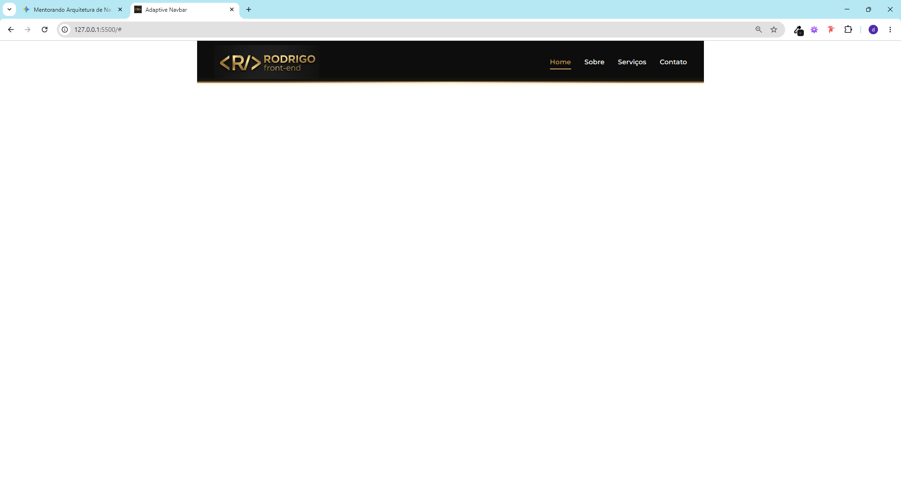
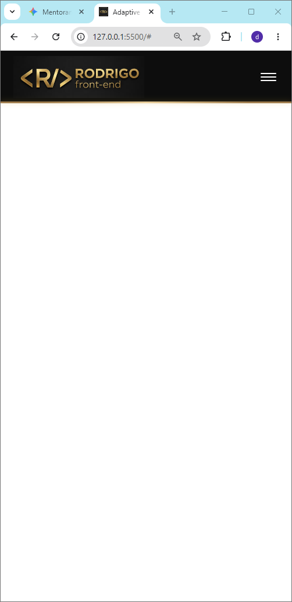

# Adaptive Navigation System 🚀

> Projeto focado na construção de um ecossistema de navegação moderno, escalável e de alto padrão (Luxury Design), utilizando fundamentos puros de Front-End.

---

## 📸 Preview do Componente

Abaixo, a demonstração visual da **V1 — Fundação Estrutural**.  
Os arquivos estão localizados dentro da estrutura de assets da versão.

| Desktop Version | Mobile Version |
| :--- | :--- |
|  |  |

---

## 🔗 Demonstração ao Vivo

Visualize o componente em funcionamento através do link oficial do GitHub Pages:

👉 **[CLIQUE AQUI PARA ACESSAR A DEMO](https://rodrigo-dias.github.io/menu-component/demo/)**

---

## 📌 Visão Geral

Este projeto documenta a evolução de uma Navbar profissional, tratando o código como um **Componente Reutilizável**.

O foco principal é consolidar o domínio sobre:

- Estruturação semântica
- Manipulação do DOM
- Arquitetura CSS escalável
- Responsividade moderna

Tudo isso antes da migração para frameworks como React ou Vue.

---

## 🎯 Filosofia de Desenvolvimento

- **Design Tokens:** uso de variáveis CSS (`:root`) para cores, fontes e transições.
- **Luxury Aesthetic:** acabamento em dourado metálico, fundo dark e elementos decorativos sofisticados.
- **Semântica:** HTML5 puro com foco em acessibilidade e SEO.
- **Layout Responsivo:** estrutura centralizada (`wrapper`) limitada a `1200px` para melhor leitura em telas Ultra-Wide.
- **Escalabilidade:** organização pensada para futura componentização.

---

## 📂 Linha do Tempo de Evolução (Timeline)

O projeto está organizado em versões para demonstrar a evolução arquitetural do componente:

1. **v1 — Fundação Estrutural (Atual)**  
   HTML/CSS base, design tokens e responsividade inicial.

2. **v2 — Interatividade Vanilla JS**  
   Manipulação de estados (aberto/fechado) utilizando objetos JavaScript.

3. **v3 — Responsividade Avançada**  
   Transição inteligente entre Navbar horizontal e Sidebar mobile.

4. **v4 — Data-Driven UI**  
   Renderização dinâmica através de estruturas JSON.

5. **v5 — UX & Dark Mode**  
   Microinterações, animações refinadas e acessibilidade aprimorada.

6. **v6 — Arquitetura Final**  
   Modularização completa inspirada em arquiteturas modernas (`src/components/`).

---

## 🏗️ Estrutura de Pastas (Objetivo Final)

O projeto evolui para a seguinte organização modular:

```text
menu-component/
├── src/
│   ├── components/   # Navbar, Sidebar, MobileMenu, Dropdown
│   ├── styles/       # Estilos globais e Design Tokens
│   ├── hooks/        # Lógica de Scroll e Eventos
│   └── data/         # Configurações JSON
│
├── v1/ a v6/         # Histórico de versões
└── demo/             # Versão estável publicada
```

---

## 🛠️ Tecnologias

- **HTML5** — Semântica avançada
- **CSS3** — Flexbox, Variáveis CSS e Pseudo-elementos
- **JavaScript (Vanilla JS)** — Estrutura futura da V2

---

## 👤 Autor

### Rodrigo Dias

Estudante de Engenharia Front-End, focado em:

- Código limpo
- Arquitetura semântica
- Interfaces modernas
- Componentização escalável
- Design de alta qualidade visual